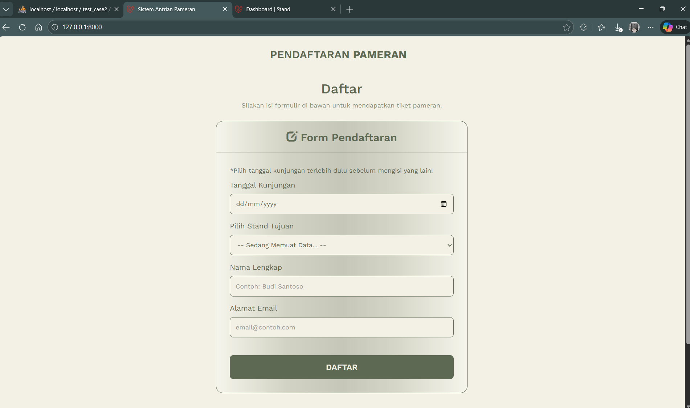
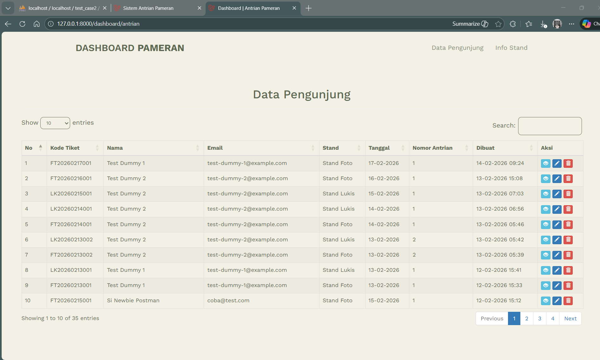
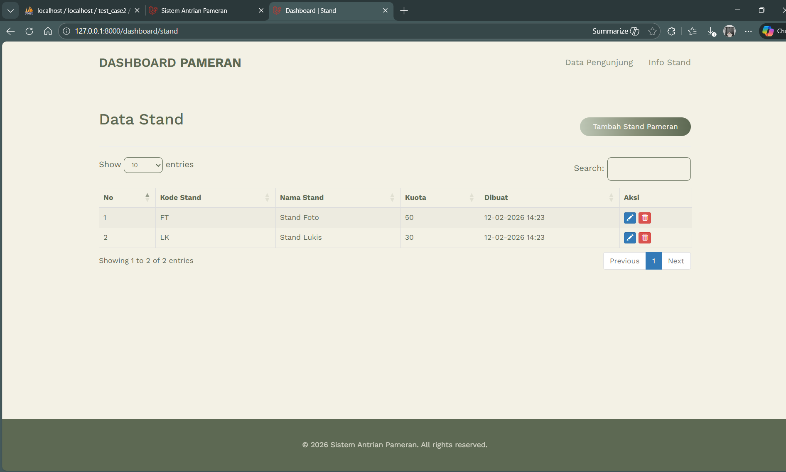

# Sistem Antrian Pameran

Sistem ini digunakan untuk **mengelola pengunjung pameran** dan **informasi stand**.  
Pengunjung bisa mendaftar antrian, melihat tiket, dan mencetak PDF.  
Admin bisa mengelola data pengunjung dan stand melalui dashboard.

---

## Fitur Utama

### Halaman Pengunjung
- Form pendaftaran antrian tiket pameran.
- Setelah mendaftar, pengunjung dapat melihat **tiket** mereka.
- Tiket bisa di-**download PDF**.

### Dashboard Admin
- **Data Pengunjung**
  - Menu menampilkan daftar pengunjung.
  - Admin bisa **Read, Update, Delete (RUD)** data pengunjung.
  - Admin bisa mencetak **tiket PDF** untuk pengunjung.
- **Info Stand**
  - Admin bisa **CRUD** data stand pameran.
  - Mengubah info stand yang sudah ada jika diperlukan.

---

## Struktur Controller

| Halaman/Menu             | Controller                        | Fungsi                                                                 |
|--------------------------|----------------------------------|------------------------------------------------------------------------|
| Pengunjung Form Antrian  | `PublicAntrianController`        | Menampilkan form antrian & tiket                                        |
| API Pengunjung           | `AntrianController` (API)        | Menyediakan data JSON untuk DataTables AJAX                             |
| Dashboard Data Pengunjung| `AntrianController` (Dashboard) | Menampilkan halaman dashboard & handle RUD via AJAX                     |
| Dashboard Info Stand     | `StandController`                 | Menampilkan halaman stand & handle CRUD via AJAX                        |

---

## Kode Tiket
Kode tiket dibentuk otomatis:

```text
kd_stand + tanggal_pesan(YYYYMMDD) + nomor_antri
````

Contoh: `FT20260219001` → Stand FT, tanggal 19 Feb 2026, nomor antrian 001.

---

## Tech Stack

* **Backend**: Laravel (PHP 8.x)
* **Frontend**: Bootstrap 3, jQuery, DataTables, SweetAlert2
* **PDF Generation**: DomPDF / Laravel PDF package
* **Database**: MySQL
* **AJAX**: Untuk CRUD tanpa reload halaman penuh

---

## Cara Instalasi & Setup

1. Clone repository:

```bash
git clone <repo-url>
cd <repo-folder>
```

2. Install dependencies:

```bash
composer install
npm install
```

3. Konfigurasi file `.env` untuk koneksi database:

```env
DB_CONNECTION=mysql
DB_HOST=127.0.0.1
DB_PORT=3306
DB_DATABASE=pameran
DB_USERNAME=root
DB_PASSWORD=
```

4. Jalankan migration & seeder:

```bash
php artisan migrate --seed
```

5. Jalankan server Laravel:

```bash
php artisan serve
```

6. Akses aplikasi:

* `/` → Form Antrian Pengunjung
* `/dashboard/antrian` → Dashboard Data Pengunjung
* `/dashboard/stand` → Dashboard Info Stand

---

## API Endpoints

### Pengunjung / Antrian

| Method | URL                        | Keterangan               |
| ------ | -------------------------- | ------------------------ |
| GET    | `/api/master-antrian`      | Ambil semua data antrian |
| GET    | `/api/master-antrian/{id}` | Detail data antrian      |
| POST   | `/api/master-antrian`      | Tambah data antrian      |
| PUT    | `/api/master-antrian/{id}` | Update data antrian      |
| DELETE | `/api/master-antrian/{id}` | Hapus data antrian       |

### Info Stand

| Method | URL                      | Keterangan             |
| ------ | ------------------------ | ---------------------- |
| GET    | `/api/master-stand`      | Ambil semua data stand |
| GET    | `/api/master-stand/{id}` | Detail data stand      |
| POST   | `/api/master-stand`      | Tambah data stand      |
| PUT    | `/api/master-stand/{id}` | Update data stand      |
| DELETE | `/api/master-stand/{id}` | Hapus data stand       |

---

## Cara Cetak PDF

* Pengunjung dapat klik tombol **Download PDF** setelah submit form.
* Admin dapat cetak tiket dari **Dashboard Data Pengunjung**.

---

## Preview Tampilan

### Halaman Pendaftaran 


### Halaman Dashboard 


